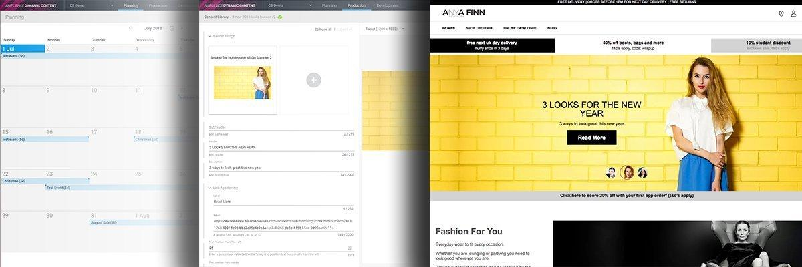

[](https://amplience.com/dynamic-content)

# Dynamic Content Accelerators - Rendering Service

> Extensible content types and rendering templates for use with the Amplience Rendering Service

[](https://github.com/amplience/dc-accelerators-content-rendering-service/releases/latest) [](https://opensource.org/licenses/Apache-2.0)

This project is designed to accelerate implementing Amplience Dynamic Content. It contains a set of commonly used components implemented as handlebars templates that can be rendered by the [Content Rendering Service](https://docs.amplience.net/integration/contentrenderingservice.html#the-content-rendering-service).

[](https://amplience.com/dynamic-content)


## Table of contents
- [Installation](#installation)
- [Demo](#demo)
- [Getting Help](#getting-help)
- [License](#license)

## Demo

* [Working demo](https://dev-solutions.s3.amazonaws.com/dc-demo-site/dist/homepage/index.html?c=d8b929ee-214d-48f0-90c0-4e121ca55a6f&s=e6bdb253-db3c-4458-b5cc-0d90aa02e114) of the accelerator components.

* [Component explorer](http://dev-solutions.s3.amazonaws.com/dc-renders-wireframe/dist/index.html?c=ab78c8be-9f03-4a52-bde0-4ebde03b79a3) showcasing the capability of each component.

## Getting started

### Developing components

This project has a local development environment which lets you test your component templates, styles and javascript without deploying them to Dynamic Content.

Steps:

1. Check-out the project
2. Install project dependencies
```js
npm install
```
3. Run development environment
```js
npm run storybook
```

This will launch a browser displaying the components using [Storybook](https://storybook.js.org/), a popular component explorer. Any changes made to template files, styles or Javascript will reload automatically.

See the [documentation](#documentation) links below for further details.

### Exporting components

Before you can deploy the components you need to run the export process. This will compile, concatenate and minify the CSS & JavaScript as well as collect the templates, icons and content types into a folder to ease deployment.


Ensure gulp-cli is installed:
```
npm install --global gulp-cli
```

Run gulp:

```
gulp
```

This will export the following files:

| file                | description                                                                                                                                                            |
|---------------------|------------------------------------------------------------------------------------------------------------------------------------------------------------------------|
| dist/contentTypes   | [Content Types](https://docs.amplience.net/integration/contenttypes.html) which define th content structure for each component.                                        |
| dist/templates      | [Content Rendering Service](https://docs.amplience.net/integration/contentrenderingservice.html#the-content-rendering-service) templates which render content to HTML. |
| dist/icons          | Icons for each component.                                                                                                                                              |
| dist/styles.min.css | CSS Styles for the components.                                                                                                                                         |
| dist/utils.min.js   | JavaScript which adds functionality to the components.                                                                                                                 |
| dist/lory.min.js    | [JavaScript Library](https://github.com/loryjs/lory) required by the Slider component.                                                                                 |

### Deploying components

...Something about how deploying content types, templates & TTs to Amplience including card settings, icons etc.

...Something about deploying CSS & JS to your application

### Using components

...Something about CSS/JS & init components JS

## Documentation

* Hosting content types externally
* Creating new components
* Extending Storybook
* Template depencencies

## Getting Help
If you need help please reach out using one of the following channels:

* Ask a question on [StackOverflow](https://stackoverflow.com/) using the tag `amplience-dynamic-content`
* Contact your [Amplience Customer Success](https://amplience.com/customer-success) representative
* If you have found a bug please report it by [opening an issue](https://github.com/amplience/dc-accelerators-content-rendering-service/issues/new)

## License

This software is licensed under the [Apache License, Version 2.0](http://www.apache.org/licenses/LICENSE-2.0),

Copyright 2019 Amplience

Licensed under the Apache License, Version 2.0 (the "License");
you may not use this file except in compliance with the License.
You may obtain a copy of the License at

    http://www.apache.org/licenses/LICENSE-2.0

Unless required by applicable law or agreed to in writing, software
distributed under the License is distributed on an "AS IS" BASIS,
WITHOUT WARRANTIES OR CONDITIONS OF ANY KIND, either express or implied.
See the License for the specific language governing permissions and
limitations under the License.
