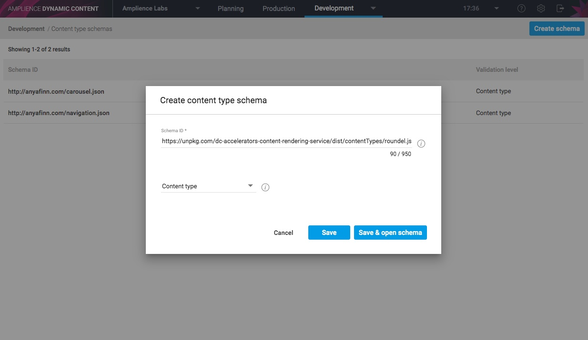
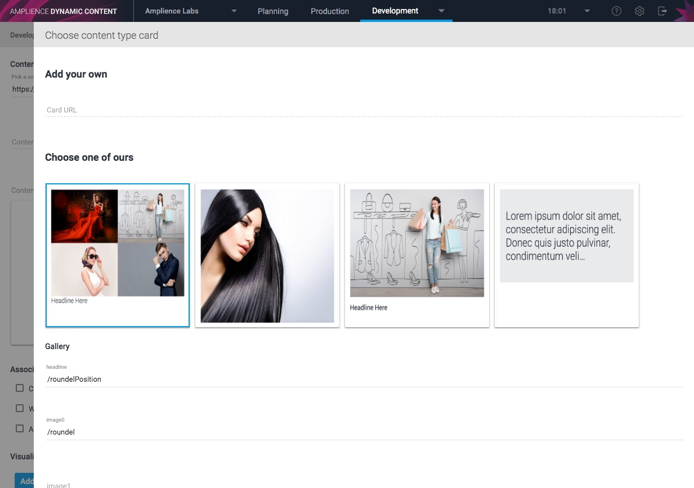
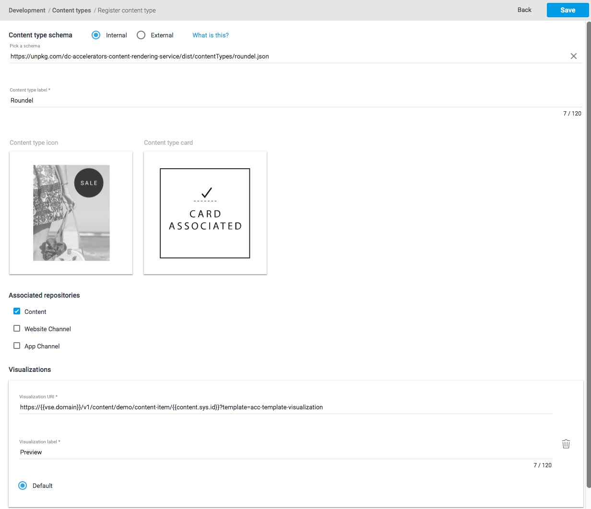
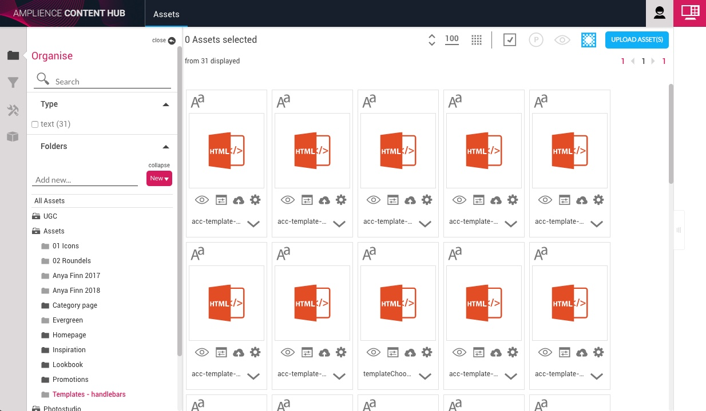
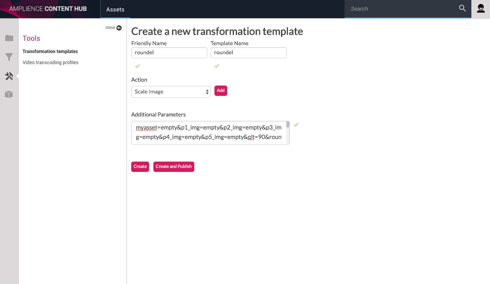

# Configure Dynamic Content

## Content Types

[Content Types](https://docs.amplience.net/integration/contenttypes.html) define the structure, format and validation rules of the content for a given component. 

### Create content type schemas

This step involves uploading the files found under dist/contentTypes into Dynamic Content. The following steps should be repeated for each content type file:

Steps:

1. Open the content type JSON file you wish to create in a text editor

2. Login to [Dynamic Content](https://content.amplience.net)

3. Navigate to the Development -> [Content type schemas screen](https://content.amplience.net/#!/labs/development/schemas/list)

4. Click "Create schema" to add a new content type schema

5. Copy the "id" field from the content type file into the Schema ID field

6. Click Save & open schema



7. Copy and paste the entire JSON file into the text editor and press save

Repeat these steps for all of the content types

### Register Content types

Once you have uploaded the content type schemas you can enable them as a content type. This will make the content type visible in the authoring UI. 

You can also setup display settings for the content type including label, icon, card (provides thumbnails of content) and visualization (provides a preview of the component while editing). 

The recommended values for these settings can be found in the table below. You can also modify these at a later date.

Mandatory Steps:

1. Login to [Dynamic Content](https://content.amplience.net)

2. Navigate to the Development -> [Content types screen](https://content.amplience.net/#!/labs/development/content-types/list)

3. Click "Register content type" to enable a new content type

4. Choose your content type schema from the dropdown

5. Enter a label for the content type. This is how content authors will see the content type.

6. Select which repositories should enable the content type from the list of check boxes.

Recommended Steps:

7. Choose an icon / copy icon URL from the recommended values below

8. Add card URL: ```https://{{vse.domain}}/v1/content/demo/content-item/{{content.sys.id}}?template=acc-template-cardsPreview```



9. Add a visualization called "Preview" with the following Visualization URL: ```https://{{vse.domain}}/v1/content/demo/content-item/{{content.sys.id}}?template=acc-template-visualization```



#### Recommended Settings

###### Roundel
- ###### Icon
	`https://dev-solutions.s3.amazonaws.com/DynamicContentTypes/Accelerators/icons/icon-imagewithroundel.png`

##### Link
- ###### Icon
	`https://dev-solutions.s3.amazonaws.com/DynamicContentTypes/Accelerators/icons/icon-link.png`

##### Image
- ###### Icon
	`https://dev-solutions.s3.amazonaws.com/DynamicContentTypes/Accelerators/icons/icon-image.png`

##### Text
- ###### Icon
	`https://dev-solutions.s3.amazonaws.com/DynamicContentTypes/Accelerators/icons/icon-text.png`

##### Video
- ###### Icon
	`https://dev-solutions.s3.amazonaws.com/DynamicContentTypes/Accelerators/icons/icon-video.png`

##### Card
- ###### Icon
	`https://dev-solutions.s3.amazonaws.com/DynamicContentTypes/Accelerators/icons/icon-card.png`

##### Card list
- ###### Icon
	`https://dev-solutions.s3.amazonaws.com/DynamicContentTypes/Accelerators/icons/icon-cardlist.png`

##### Banner
- ###### Icon
	`https://dev-solutions.s3.amazonaws.com/DynamicContentTypes/Accelerators/icons/icon-banner.png`
	
##### Slider
- ###### Icon
	`https://dev-solutions.s3.amazonaws.com/DynamicContentTypes/Accelerators/icons/icon-slider.png`

##### Split block
- ###### Icon
	`https://dev-solutions.s3.amazonaws.com/DynamicContentTypes/Accelerators/icons/icon-splitblock.png`
	
##### Promo
- ###### Icon
	`https://dev-solutions.s3.amazonaws.com/DynamicContentTypes/Accelerators/icons/icon-promobannersection.png`

##### Promo List
- ###### Icon
	`https://dev-solutions.s3.amazonaws.com/DynamicContentTypes/Accelerators/icons/icon-promobanner.png`

##### External block

- ###### Icon
	`https://dev-solutions.s3.amazonaws.com/DynamicContentTypes/Accelerators/icons/icon-externalblock.png`

##### Snippet
- ###### Icon
	`https://dev-solutions.s3.amazonaws.com/DynamicContentTypes/Accelerators/icons/icon-blogsnippet.png`

##### Blog Post
- ###### Icon
	`https://dev-solutions.s3.amazonaws.com/DynamicContentTypes/Accelerators/icons/icon-blogpost.png`

##### Page
- ###### Icon
	`https://dev-solutions.s3.amazonaws.com/DynamicContentTypes/Accelerators/icons/icon-page.png`

## Content Rendering Templates

Content Rendering Templates are handlebars templates that convert the JSON content produced by a content author into HTML.

### Steps

1. Login to [Content Hub](https://ondemand.amplience.com)

2. Navigate to the Assets tab

3. Press Upload

4. Drag the template files found in dist/templates into the upload window.




## Image Transformation Templates

This project makes use of [Image Transformation Templates](https://docs.amplience.net/contenthub/tools.html#templates). These contain pre-defined image manipulation rules which are used to automatically resize and crop images as well as superimpose buttons and roundels on the fly.

### Templates

Below is a list of transformation templates required by the accelerator components.

| friendly name  | name           | parameters                                                                                                                                                                                                                                                                                                                                                                                                                                                                                                                                                                                                                                                                                                                                                                                                                                                                                                                                                                                                                                                                                         |
|----------------|----------------|----------------------------------------------------------------------------------------------------------------------------------------------------------------------------------------------------------------------------------------------------------------------------------------------------------------------------------------------------------------------------------------------------------------------------------------------------------------------------------------------------------------------------------------------------------------------------------------------------------------------------------------------------------------------------------------------------------------------------------------------------------------------------------------------------------------------------------------------------------------------------------------------------------------------------------------------------------------------------------------------------------------------------------------------------------------------------------------------------|
| roundel        | roundel        | ``` myasset=empty&p1_img=empty&p2_img=empty&p3_img=empty&p4_img=empty&p5_img=empty&qlt=90&roundelRatio1=1&roundelRatio2=1&roundelRatio3=1&roundelRatio4=1&roundelRatio5=1&layer1=[src=/i//{$p1_img}&w={$root.layer0.info.canvas.width*$roundelRatio1}&left={$root.layer0.info.canvas.width-10}&bottom=10&anchor=BR&visible={$p1_img!=$myasset}]&layer2=[src=/i//{$p2_img}&w={$root.layer0.info.canvas.width*$roundelRatio2}&left=10&bottom=10&anchor=BL&visible={$p2_img!=$myasset}]&layer3=[src=/i//{$p3_img}&w={$root.layer0.info.canvas.width*$roundelRatio3}&left=10&top=10&anchor=TL&visible={$p3_img!=$myasset}]&layer4=[src=/i//{$p4_img}&w={$root.layer0.info.canvas.width*$roundelRatio4}&left={$root.layer0.info.canvas.width-10}&top=10&anchor=TR&visible={$p4_img!=$myasset}]&layer5=[src=/i//{$p5_img}&w={$root.layer0.info.canvas.width*$roundelRatio5}&right={$root.layer0.info.canvas.width/2}&top={$root.layer0.info.canvas.height/2}&anchor=MC&visible={$p5_img!=$myasset}]```                                                                                                    |
| poi            | poi            | ``` scaleFit=poi&poi={$this.metadata.pointOfInterest.x},{$this.metadata.pointOfInterest.y},{$this.metadata.pointOfInterest.w},{$this.metadata.pointOfInterest.h} ```                                                                                                                                                                                                                                                                                                                                                                                                                                                                                                                                                                                                                                                                                                                                                                                                                                                                                                                               |
| banner-poi     | banner-poi     | ``` layer0=[scaleFit=poi&poi={$this.metadata.pointOfInterest.x?$this.metadata.pointOfInterest.x:0.36},{$this.metadata.pointOfInterest.y?$this.metadata.pointOfInterest.y:0.5},{$this.metadata.pointOfInterest.w?$this.metadata.pointOfInterest.w:0.26},{$this.metadata.pointOfInterest.h?$this.metadata.pointOfInterest.h:0.125}&sm=c&aspect=1:1&w={$this.metadata.image.height>768?768:$this.metadata.image.height}&h={$this.metadata.image.height>768?768:$this.metadata.image.height}]] ```                                                                                                                                                                                                                                                                                                                                                                                                                                                                                                                                                                                                                                                                                                                                                                                                                                                                                          |

### Steps:

1. Login to [Content Hub](https://ondemand.amplience.com)

2. Navigate to Tools -> Transformation Templates

3. Press the new button to create a new Transformation Template

4. Fill out the friendly name, name and additional parameters fields



5. Press Create and Publish

6. Repeat this process for all 4 of the transformation templates

### Upload empty.png

The transformation templates reference an “empty.png” image which must be uploaded in your assets tab and published. This image will act as a background for the layers in the transformation templates, before they are populated with images. The empty image `empty.png` can be found in the root of this project.
